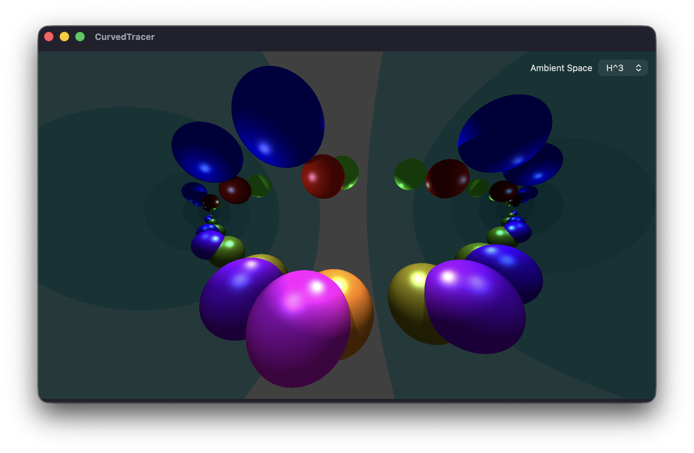
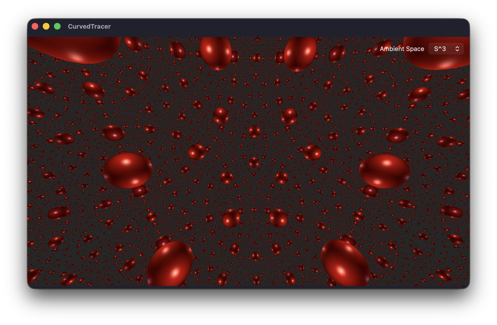

# CurvedTracer

A real-time ray tracer for non-Euclidean 3D spaces — spherical **S³** and hyperbolic **H³**.

The scene is stored intrinsically as a set of disk charts connected by Möbius transitions. Each frame, the C++ geometry core flattens the visible charts into a single camera chart and emits a byte packet consumed by a Metal GPU ray tracer. Rays through the chart origin are straight geodesics, and mirror reflections unfold the world back into the same straight-ray model.

## Screenshot

Several balls between two totally geodesic mirrors:


Balls centered at the cells of {4,3,5}:


## Repository layout

| Path | Description |
|---|---|
| `GeometryCore/` | Swift package containing the C++ geometry/atlas core and tests |
| `CurvedTracer/` | macOS SwiftUI + Metal app |
| `CONTRACT.md` | Normative C++/Metal/Swift seam specification |
| `Images/` | Rendered screenshots |

## GeometryCore

- Charts are open geodesic disks; objects are hyperplane sections `a·x + b·sqrt(1-|x|²) = c`.
- Charts relate by pairwise Möbius transitions (Lorentz matrices for H³, O(4) matrices for S³).
- `Atlas::build` validates the chart graph, flattens all objects/lights into the camera chart, and emits a deterministic `ScenePacket`.
- Shared math headers (`Math.h`, `Scene.h`, `Intersect.h`) compile in both C++ and Metal.

### Build & test (Linux/macOS)

```bash
cd GeometryCore
swift test                 # Swift + C++ interop tests
swift run geometry_tests   # full C++ test suite
```

## macOS app

Build and run `CurvedTracer.xcodeproj` with Xcode on macOS.

Press **Tab** to enter control mode:

| Input | Action |
|---|---|
| Mouse move | Look around |
| W / S | Move forward / back |
| A / D | Move left / right |
| R / F | Move up / down |
| Q / E | Roll left / right |
| Tab | Toggle on / off control mode |

## Acknowledgement

Most of the code in this repository was written by **DeepSeek-V4-Pro**.
